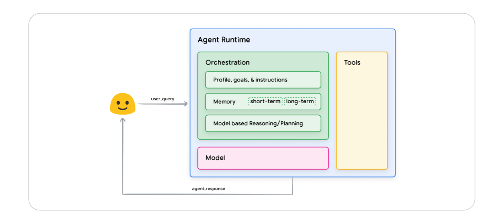

  <h1>🗣️ LLM Agents Course 🤖</h1>
</h1>
  

    💼 <a href="https://linkedin.com/in/peyman-kor">Follow me on Linkedin </a> 
  

 

A Course to get into Large Language Models (LLM) Agents with roadmap and python notebooks.

---

## Table of Contents

- [Table of Contents](#table-of-contents)
- [Theoretical Frameworks](#theoretical-frameworks)
  - [📚 References](#-references)
- [Hands-on Coding](#hands-on-coding)
  - [📚 Notebooks \& Projects](#-notebooks--projects)
- [Python Frameworks](#python-frameworks)
- [Online Video Courses (Free)](#online-video-courses-free)
- [Acknowledgements](#acknowledgements)

---

## Theoretical Frameworks

 General agent architecture and components, [(source)](https://linkcuts.com/mg7ckohn)

Here is a list of the most important papers and articles that I have read about LLMs Agents Essentially, here the gaol is to build foundational knowledge about LLMs Agents.

### 📚 References

- **[Agents](https://linkcuts.com/mg7ckohn)**: Wiesinger, Julia, Patrick Marlow, and Vladimir Vuskovic, (2024) - Google White Paper
- **[Agents](https://huyenchip.com/2025/01/07/agents.html)**, Chip Huyen (2025)
- **[Agentic Design Patterns : Four AI agent strategies](https://www.deeplearning.ai/the-batch/how-agents-can-improve-llm-performance/?ref=dl-staging-website.ghost.io)**, Andrew NG, 2024 -
   - [Agentic Design Patterns Part 2, Reflection](https://www.deeplearning.ai/the-batch/agentic-design-patterns-part-2-reflection/?ref=dl-staging-website.ghost.io)
   - [Agentic Design Patterns Part 3, Tool Use](https://www.deeplearning.ai/the-batch/agentic-design-patterns-part-3-tool-use/?ref=dl-staging-website.ghost.io)
   - [Agentic Design Patterns Part 4, Planning](https://www.deeplearning.ai/the-batch/agentic-design-patterns-part-4-planning/?ref=dl-staging-website.ghost.io)
   - [Agentic Design Patterns Part 5, Multi-Agent Collaboration](https://www.deeplearning.ai/the-batch/agentic-design-patterns-part-5-multi-agent-collaboration/?ref=dl-staging-website.ghost.io)

---

## Hands-on Coding 

These are the most important hands-on coding projects that I have seen LLMs Agents. I focus on the hands-on and the projects that have Python implementation.

### 📚 Notebooks & Projects

- **[Four AI Agent Pattern Implementations](https://github.com/neural-maze/agentic_patterns?tab=readme-ov-file#using-a-reflection-agent---reflection-pattern)**
  - [Reflection Pattern](https://github.com/neural-maze/agentic_patterns/blob/main/notebooks/reflection_pattern.ipynb)
  - [Tool Use Pattern](https://github.com/neural-maze/agentic_patterns/blob/main/notebooks/tool_pattern.ipynb)
  - [Planning Pattern](https://github.com/neural-maze/agentic_patterns/blob/main/notebooks/planning_pattern.ipynb)
  - [Multi-Agent Collaboration Pattern](https://github.com/neural-maze/agentic_patterns/blob/main/notebooks/multiagent_pattern.ipynb)
  
- **[Anthropic Buidling Effective Agents](https://github.com/anthropics/anthropic-cookbook/tree/main/patterns/agents)**
  - [Basic Workflows](https://github.com/anthropics/anthropic-cookbook/blob/main/patterns/agents/basic_workflows.ipynb)
  - [Evaluator-Optimizer Workflow](https://github.com/anthropics/anthropic-cookbook/blob/main/patterns/agents/evaluator_optimizer.ipynb)
  - [Orchestrator-Workers Workflow](https://github.com/anthropics/anthropic-cookbook/blob/main/patterns/agents/orchestrator_workers.ipynb)
- **[Agentic AI: Building Autonomous Systems from Scratch](https://towardsdatascience.com/agentic-ai-building-autonomous-systems-from-scratch-8f80b07229ea)**

---

## Python Frameworks

These are the established Python Frameworks for LLMs Agents.
- **[Langchain](https://www.langchain.com/)**
- **[smolagents](https://github.com/huggingface/smolagents)** 🤗

---

## Online Video Courses (Free)

- **[Introduction to LangGraph](https://academy.langchain.com/courses/intro-to-langgraph)**
  - 54 lessons , 6 hours of video content
- **[Agentic Pattern Series](https://www.youtube.com/watch?v=0sAVI8bQdRc&list=PLacQJwuclt_sK_pUPzBpfeWyiL1QOSMRQ&index=4)** (by [The Neural Maze](https://neural-maze.github.io/blog/about/) @neural-maze)
    - 4 lessons , around 2 hours of video content

---

## Acknowledgements

This roadmap was inspired by the excellent [DevOps Roadmap](https://github.com/milanm/devops-roadmap) from Milan Milanović and the [LLM roadmap](https://github.com/mlabonne/llm-course/tree/main?tab=readme-ov-file) from Maxime Labonne.

